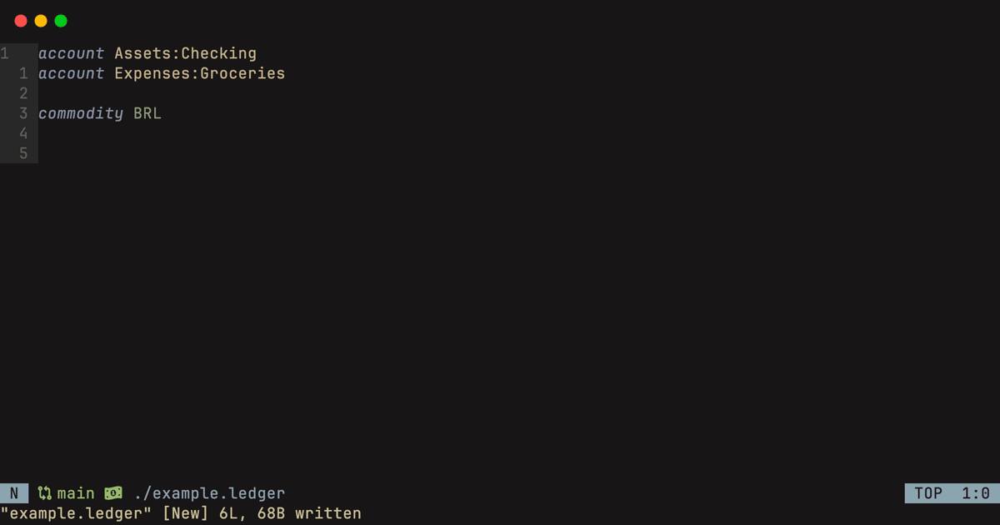

# Ledger nvim

<div align="center">

Neovim integration for ledger files, powered by tree-sitter

</div>



## Motivation

I’m a big fan of plain-text accounting and use Ledger to track my finances.
However, I’ve been wanting better Neovim integration for Ledger files for
some time.

This project is all about leveraging the ecosystem to bring in completions,
snippets, and other cool features that I’ve been missing.

This is a personal side project, so updates might come a bit slowly.

## Installation

### Lazy.nvim

Add the following snippet to your lazy configuration

```lua
{
  'wllfaria/ledger.nvim',
  -- tree sitter needs to be loaded before ledger.nvim loads
  dependencies = { 'nvim-treesitter/nvim-treesitter' },
  config = function()
    require('ledger').setup()
  end,
}
```

## Configuration

Below are the default configurations for ledger.nvim, you can set anything
to your liking.

```lua
{
  extensions = {
    "ledger",
    "hledger",
    "journal",
  },
  completion = {
    cmp = { enabled = true },
  },
  snippets = {
    cmp = { enabled = true },
    luasnip = { enabled = false },
    native = { enabled = false },
  },
  keymaps = {
    snippets = {
      new_posting = { "tt" },
      new_account = { "acc" },
      new_posting_today = { "td" },
      new_commodity = { "cm" },
    },
  },
  diagnostics = {
    lsp_diagnostics = true,
    strict = false,
  }
}
```

<details>
<summary>Expand to see each option in detail</summary>

- The `extensions` field lets you specify which file extensions should be recognized
  as Ledger files. The plugin will parse these files to extract account names,
  commodities, and other info used for autocompletion and diagnostics.
- The `completion` field controls which completion engine is used for account and
  commodities completion. Right now, we only support nvim-cmp, but this will expand
  soon. You can disable completion by setting the enabled value to false.
- The `snippets` field defines which snippet engine you want to use. Currently, we
  support native, cmp, and luasnip, with cmp being the default.
  - `cmp`: This sets up snippets as a completion source in nvim-cmp, offering snippet
    autocompletion. It works well even when combined with luasnip.
  - `native`: This uses vim.snippet.expand and sets keymaps for each snippet based on
    the keymaps field. It’s a bit clunky, but it’s an option if you prefer it.
  - `luasnip`: This integrates with luasnip to add snippets to Ledger files. It also
    works smoothly alongside nvim-cmp.
- The `keymaps` field defines key mappings for different parts of the plugin:
  - The `snippets` section defines keymaps or triggers for snippets. If you're using
    native as your snippet engine, this will set the actual keymap in Neovim. You can
    disable a snippet by either removing it from the list or removing its triggers.
- The `diagnostics` field lets you customize how diagnostics work in Ledger:
  - `lsp_diagnostics` sets diagnostics using vim.diagnostic.set, so it works like an
    LSP diagnostic, populating your workspace diagnostics.
  - `strict` ensures that undeclared commodities and accounts are treated as errors
    rather than warnings.

</details>

## Features

- Autocompletion for account names, powered by nvim-cmp
- Snippets for common actions (creating postings, accounts, commodities, etc.)
- Diagnostics for undeclared commodities and accounts
- And a few other things that I still have to code

## Related projects

- [vim-ledger](https://github.com/ledger/vim-ledger)
